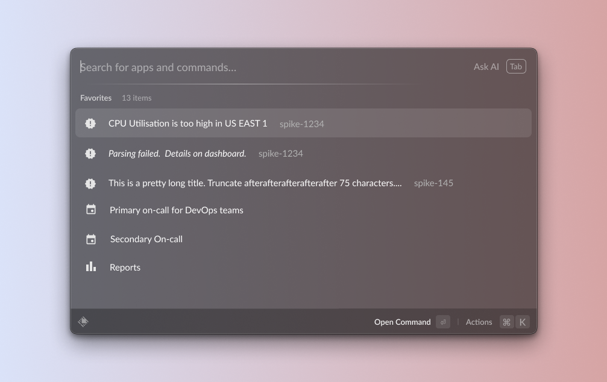

# Spike Raycast Extension



## Overview

Spike's Raycast extension brings incident management and on-call functionalities directly into operating system. This extension allows you to manage incidents, view on-call schedules, add on-call overrides, and access your favorites without leaving your workflow.

## Features

1. **Incidents**: View and manage open incidents directly from Raycast
2. **On-Call**: Check your on-call status and see who's currently on call
3. **On-Call Override**: Add overrides to On-call schedules
4. **Favorites**: Quick access to your favorite Spike entities
5. **Menu Bar Integration**: View open incidents from your menu bar

## Actions available

### Incidents

1. Acknowledge and Resolve incidents
2. View Incident details
3. View Activity log

### On-call

1. View On-call details
2. Add On-call override

## Installation

1. Make sure you have [Raycast](https://raycast.com/) installed.
2. Open Raycast and search for "Spike".
3. Click "Install" to add the Spike extension to your Raycast.

## Development
To contribute to this extension:

1. Clone the repository:
   ```
   git clone https://github.com/spikehq/raycast-extension.git
   ```
2. Install dependencies:
   ```
   npm install
   ```
3. Run the development server:
   ```
   npm run dev
   ```
4. Import Spike to your raycast

- Open Raycast
- Search for `Import extension`
- Import whole `spike-raycast` folder
